# Buy Odd Yucca Concert

---

[](https://twitter.com/intent/tweet?text=%20Checkout%20this%20%40github%20repo%20by%20%40joaofse%20%F0%9F%91%A8%F0%9F%8F%BD%E2%80%8D%F0%9F%92%BB%3A%20https%3A//github.com/jesperancinha/buy-odd-yucca-concert)
[](https://github.com/jesperancinha/buy-odd-yucca-concert)

[](https://www.apache.org/licenses/LICENSE-2.0)

[](https://circleci.com/gh/jesperancinha/buy-odd-yucca-concert/tree/master)
[](https://github.com/jesperancinha/buy-odd-yucca-concert/actions/workflows/buy-odd-yucca-concert.yml)
[](https://github.com/jesperancinha/buy-odd-yucca-concert/actions/workflows/buy-odd-yucca-concert-chain-test.yml)
[](https://ci.appveyor.com/project/jesperancinha/buy-odd-yucca-concert)
[](https://github.com/jesperancinha/buy-odd-yucca-concert/actions/workflows/buy-odd-yucca-concert-e2e.yml)

[](https://www.codacy.com/gh/jesperancinha/buy-odd-yucca-concert/dashboard?utm_source=github.com&amp;utm_medium=referral&amp;utm_content=jesperancinha/buy-odd-yucca-concert&amp;utm_campaign=Badge_Grade)
[](https://snyk.io/test/github/jesperancinha/buy-odd-yucca-concert)

[](https://www.codacy.com/gh/jesperancinha/buy-odd-yucca-concert/dashboard?utm_source=github.com&utm_medium=referral&utm_content=jesperancinha/buy-odd-yucca-concert&utm_campaign=Badge_Coverage)
[](https://codecov.io/gh/jesperancinha/buy-odd-yucca-concert)
[](https://coveralls.io/github/jesperancinha/buy-odd-yucca-concert?branch=master)

[](#)
[](#)
[](#)

---

## Technologies used

Please check the [TechStack.md](TechStack.md) file for details.

<details>
<summary><h2><b>1. Introduction</b></h2></summary>


#### 1.1. - Stable releases

-   [1.0.0](https://github.com/jesperancinha/buy-odd-yucca-concert/tree/1.0.0) - [ece419c8db3648da259b3044e21918e5fcda33c5](https://github.com/jesperancinha/buy-odd-yucca-concert/tree/1.0.0)

---
</details>

## 2.  - Installing NVM 🌴

You don't need to install NVM per se. This may only be need if you are running a non LTS version of nodejs. In that case, just run:

```shell
nvm-install.sh
node -v
```

## 3.  - How to run

<details>
<summary style="font-size: large"><b>3.1 - Run docker</b></summary>

---
#### 3.1.1. - Optional Intallation (Mostly if something is not quite correctly configured)
```shell
sudo usermod -a -G docker $(whoami)
```

Restart and:

```shell
newgrp docker
```

#### 3.1.2. - Start Application

```shell
make docker-clean-build-start
```
---
</details>

<details>
<summary style="font-size: large"><b>3.2 - Load Kong Settings</b></summary>

---
Wait for containers to start (usually no more than 10 seconds).

```shell
make kong-setup
```
---
</details>

<details>
<summary style="font-size: large"><b>3.3 - Settings</b></summary>

---


This project is built upon node v16.13.1

[NVM-SH](https://github.com/nvm-sh/nvm/blob/master/README.md)
---
</details>

<details>
<summary style="font-size: large"><b>3.4 - Docker Usage</b></summary>

---
#### 3.4.1. - Using Containers
```shell
docker exec -it buy-oyc-nginx /bin/bash
docker exec -it kong /bin/bash
docker exec -it buy-oyc-parking /bin/bash
docker exec -it buy-oyc-ticket /bin/bash
```

#### 3.4.2. - Endpoints from inside Docker


-   [http://buy-oyc-ticket:8000/api/yucca-ticket](http://buy-oyc-ticket:8000/api/yucca-ticket)

```shell
curl http://buy-oyc-ticket:8000/api/yucca-ticket
```

#### 3.4.3. - Endpoints open to the outside


API

-   [http://localhost:8080](http://localhost:8080)
-   [http://localhost:8000/api/yucca-api/](http://localhost:8000/api/yucca-api/)
-   [http://localhost:8000/api/yucca-ticket/](http://localhost:8000/api/yucca-ticket/)
-   [http://localhost:8000/api/yucca-parking/](http://localhost:8000/api/yucca-parking/)
-   [http://localhost:8000/api/yucca-catering/](http://localhost:8000/api/yucca-catering/)

Routes

-   [Main](http://localhost:8001)
-   [Routes](http://localhost:8001/routes)

#### 3.4.4. - Swagger UI Tests

Although this project is meant to be used with Locust and for benchmark testing and rate-limiting, it may be interesting to understand the data model first. Swagger UI helps with that.

>Please run `make docker-clean-build-start` before anything.
>If you are running the services outside Docker, please make sure to have these environment variables assigned:
>`POSTGRESQL_HOST=localhost;REDIS_HOST=localhost`

Here are the endpoints for the services with the open port:

-   [buy-oyc-api-service](http://localhost:8088/swagger/views/swagger-ui/index.html)
-   [buy-oyc-catering-service](http://localhost:8087/swagger/views/swagger-ui/index.html)
-   [buy-oyc-concert-service](http://localhost:8085/swagger/views/swagger-ui/index.html)
-   [buy-oyc-parking-service](http://localhost:8086/swagger/views/swagger-ui/index.html)
-   [buy-oyc-ticket-service](http://localhost:8084/swagger/views/swagger-ui/index.html)

Via Kong Gateway for `swagger.yml`

-   [http://localhost:8000/api/yucca-api/swagger/swagger.yml](http://localhost:8000/api/yucca-api/swagger/swagger.yml)
-   [http://localhost:8000/api/yucca-ticket/swagger/swagger.yml](http://localhost:8000/api/yucca-ticket/swagger/swagger.yml)
-   [http://localhost:8000/api/yucca-parking/swagger/swagger.yml](http://localhost:8000/api/yucca-parking/swagger/swagger.yml)
-   [http://localhost:8000/api/yucca-catering/swagger/swagger.yml](http://localhost:8000/api/yucca-catering/swagger/swagger.yml)
-   [http://localhost:8000/api/yucca-concert/swagger/swagger.yml](http://localhost:8000/api/yucca-concert/swagger/swagger.yml)

Via Kong Gateway for Swagger UI

-   [http://localhost:8000/api/yucca-api/swagger/views/swagger-ui/index.html](http://localhost:8000/api/yucca-api/swagger/views/swagger-ui/index.html)
-   [http://localhost:8000/api/yucca-ticket/swagger/views/swagger-ui/index.html](http://localhost:8000/api/yucca-ticket/swagger/views/swagger-ui/index.html)
-   [http://localhost:8000/api/yucca-parking/swagger/views/swagger-ui/index.html](http://localhost:8000/api/yucca-parking/swagger/views/swagger-ui/index.html)
-   [http://localhost:8000/api/yucca-catering/swagger/views/swagger-ui/index.html](http://localhost:8000/api/yucca-catering/swagger/views/swagger-ui/index.html)
-   [http://localhost:8000/api/yucca-concert/swagger/views/swagger-ui/index.html](http://localhost:8000/api/yucca-concert/swagger/views/swagger-ui/index.html)

> Make sure to check the [e2e](./e2e) tests in order to see how Swagger is implemented. The Explorer textbox needs to be manually configured at the moment.

#### 3.4.5 Cypress tests

In order to run cypress tests, please run

```shell
make dcup-full
```

Then go to the [e2e](./e2e) folder and run:

```shell
make cypress-open
```

The cypress test management window should open and you should be able to perform your tests manually.
---
</details>


<details>
<summary style="font-size: large"><b>3.5. - Security Report</b></summary>

---
```shell
mvn clean install -Powasp
```
Read report after running:

-   [buy-oyc-commons](buy-oyc-commons/target/dependency-check-report.html)
-   [buy-oyc-catering-service](buy-oyc-catering-service/target/dependency-check-report.html)
-   [buy-oyc-parking-service](buy-oyc-parking-service/target/dependency-check-report.html)
-   [buy-oyc-ticket-service](buy-oyc-ticket-service/target/dependency-check-report.html)
---
</details>

---

<details>
<summary><h2><b>4.  Run chain tests</b></h2></summary>

---
```shell
make build-integration
```
---
</details>

---

<details>
<summary><h2><b>5. Coffee sessions</b></h2></summary>

---
-   [Making Regression/Chain tests in Micronaut](https://www.buymeacoffee.com/jesperancinha/coroutines-kotest-engine-brawl)
-   [Pub-sub Redis in Micronaut](https://www.buymeacoffee.com/jesperancinha/pub-sub-redis-micronaut)
-   [Micronaut - Getting the basics](https://www.buymeacoffee.com/jesperancinha/micronaut-getting-basics)
-   [Redis Cache - A String story](https://www.buymeacoffee.com/jesperancinha/redis-cache-a-string-story)
-   [Kotlin's reified and why you should use it(or maybe not)](https://www.buymeacoffee.com/jesperancinha/kotlin-reified-use)
-   [Kotlin Data Modelling with Micronaut](https://www.buymeacoffee.com/jesperancinha/kotlin-data-modelling-micronaut)
-   [Micronaut and Kotlin - Making round trip integration tests](https://www.buymeacoffee.com/jesperancinha/round-trip-testing-micronaut)
---
</details>

---

## 6.  Sequence Diagram

```mermaid
sequenceDiagram
    participant Customer Service Client
    participant API
    participant Ticket API
    participant Concert API
    participant Catering API
    participant Parking API
    participant Redis
    participant Database
    
    rect rgb(1,40,25)
        Customer Service Client -->> API: Request Ticket Reservation (POST)
        API -->> Database: Persists Reservation
        Database -->> API: Delivers record with Reference ID
        API -->> Redis: Publishes TicketDto Payload
        API -->> Customer Service Client: Response with reservation number
        Redis --x API: Listens to TicketDto
        API -->> Ticket API: Posts ticket dto payload
        Ticket API -->> Redis: Publish Ticket Dto to Redis
        Ticket API --x API: Async ACK
        Redis --x Ticket API: Listen to Ticket Dto
        Ticket API -->> Concert API: Post Concert Fragment
        Concert API --x Redis: Publish Concert
        Concert API --x Ticket API: Async ACK
        Ticket API -->> Catering API: Send Drink(s)
        Catering API --x Redis: Publish Drink(s)
        Catering API --x Ticket API: Drink Async ACK
        Ticket API -->> Catering API: Send Meal(s)
        Catering API --x Redis: Publish Meal(s)
        Catering API --x Ticket API: Meal Async ACK
        Ticket API -->> Parking API: Send Parking Reservation
        Parking API --x Ticket API: Parking Reservation ACK
        Parking API --x Redis: Publish Parking Reservation
        Redis --x Concert API: Listen to concert data
        Concert API --x Database: Persist concert data
        Redis --x Catering API: Listen to drink data
        Catering API --x Database: Persist drinks data
        Redis --x Catering API: Listen to meal data
        Catering API --x Database: Persist meals data
        Redis --x Parking API: Listen to parking data
        Parking API --x Database: Persist parking data
    end
```



## 7  References

<details>
<summary><b>7.1. Online</b></summary>

#### 

-   [Permission issue with PostgreSQL in docker container](https://stackoverflow.com/questions/56188573/permission-issue-with-postgresql-in-docker-container)
-   [What kinds of bot attacks are stopped by rate limiting?](https://www.cloudflare.com/en-gb/learning/bots/what-is-rate-limiting/)
-   [Using Micronaut Data, JDBC, R2DBC, TestContainers, and Flyway with multiple schemas](https://www.zsiegel.com/2022/01/25/Micronaut-JDBC-R2DBC-Flyway-multiple-schemas)
-   [Realtime Testing: Micronaut, Postgres and Testcontainer](https://blog.pallav.dev/realtime-testing-micronaut-postgres-and-testcontainer)
-   [Entity-Relationship Diagram Symbols and Notation](https://www.lucidchart.com/pages/ER-diagram-symbols-and-meaning)
-   [MICRONAUT 1.0 RC1 AND THE POWER OF AHEAD-OF-TIME COMPILATION](https://micronaut.io/2018/09/30/micronaut-1-0-rc1-and-the-power-of-ahead-of-time-compilation/)
-   [From Spring Boot to Micronaut](https://blog.frankel.ch/spring-to-micronaut/)
-   [Create a New React App](https://reactjs.org/docs/create-a-new-react-app.html)
-   [Micronaut: A five-minute introduction](https://dev.to/mkbaldwin/micronaut-a-five-minute-introduction-c27)
-   [Micronaut CLI](https://docs.micronaut.io/latest/guide/#cli)
-   [CREATING YOUR FIRST MICRONAUT APPLICATION](https://guides.micronaut.io/latest/creating-your-first-micronaut-app-maven-kotlin.html)
-   [Micronaut](https://micronaut.io/)
-   [Deploy an Enterprise License](https://docs.konghq.com/gateway/2.6.x/plan-and-deploy/licenses/deploy-license/)
-   [Kong Gateway Licensing @ Kong Docs](https://docs.konghq.com/gateway/2.6.x/plan-and-deploy/licenses/)
-   [How To Enable the Dev Portal @ Kong Docs](https://docs.konghq.com/gateway/2.6.x/developer-portal/enable-dev-portal/)
-   [Kong /docker-kong 🦍 (sounds like Donkey Kong!)](https://github.com/Kong/docker-kong/tree/master/compose)
-   [Kong Gateway](https://docs.konghq.com/gateway/)
-   [MemboxX](https://www.crunchbase.com/organization/memboxx)
-   [Kong Inc. Wikipedia Repubished](https://wiki2.org/en/Kong_Inc.)
-   [5 questions for Kong CEO Augusto Marietti](https://www.bizjournals.com/sanfrancisco/news/2018/11/29/5-questions-for-kong-ceo-augusto-marietti.html)
-   [Author: Augusto Marietti](https://konghq.com/blog/author/augusto/)
-   [Years after crashing on Travis Kalanick’s couch, this founder has raised $18M for his startup, Mashape](https://techcrunch.com/2017/03/23/years-after-crashing-on-travis-kalanicks-couch-this-italian-founder-just-raised-18-million-for-his-startup/)
-   [Mashape Rebrands as Kong Inc., Declares Monolithic Application Dead](https://www.globenewswire.com/news-release/2017/10/16/1230930/0/en/Mashape-Rebrands-as-Kong-Inc-Declares-Monolithic-Application-Dead.html)
-   [Kong Inc.](https://en.wikipedia.org/wiki/Kong_Inc.)
-   [Redhwan Nacef's Kong Tutorial On GitHub](https://github.com/redhwannacef/youtube-tutorials/tree/main/kong-gateway)
-   [Lorem Picsum Phosots](https://picsum.photos/)
---
</details>
<details>
<summary><b>7.2. Online Videos</b></summary>

---

-   [Kong Gateway for Beginners: Adding a Service, Route and Plugins](https://www.youtube.com/watch?v=kGZyAEVioWg)
-   [Kong Gateway Tutorial | API Gateway For Beginners](https://www.youtube.com/watch?v=20rOdqag4Dw)
-   [How to Use Kong Gateway JWT Plugin](https://www.youtube.com/watch?v=OjF95vVldxY)
-   [Developing Micronaut Applications with IntelliJ IDEA](https://www.youtube.com/watch?v=KIp9PlyJOjg)
-   [Micronaut Deep Dive by Graeme Rocher](https://www.youtube.com/watch?v=S5yfTfPeue8)
-   [Introduction to Micronaut • Graeme Rocher • GOTO 2019](https://www.youtube.com/watch?v=RtjSqRZ_md4)
-   [What is Rate Limiting / API Throttling? | System Design Concepts](https://www.youtube.com/watch?v=9CIjoWPwAhU)
-   [API Gateway Plugins for Kubernetes Ingress Controller](https://www.youtube.com/watch?v=xHpYbncyXmA)
-   [Installing Kong's API Gateway with Docker](https://www.youtube.com/watch?v=sJEID1xEZMg)
-   [DevOps Is More Than Configuration Management](https://www.youtube.com/watch?v=vmgvs11XKow)
-   [DynamoDB Partitions - How they work - AWS Service Deep Dive](https://www.youtube.com/watch?v=WoxNmq5-E9o)
-   [Working with DynamoDB Tables - Partition Key and Sort Key - Dynamo Deep Dive](https://www.youtube.com/watch?v=T6VZ_GfQdvo)
-   [AWS re:Invent 2018: Amazon DynamoDB Deep Dive: Advanced Design Patterns for DynamoDB (DAT401)](https://www.youtube.com/watch?v=HaEPXoXVf2k)
-   [What is a DynamoDB GSI (Global Secondary Index) ?](https://www.youtube.com/watch?v=ihMOlb8EZKE)

---
</details>

## About me

[](https://github.com/jesperancinha)
