# buy-oyc-api-service

Buy Odd Yucca Concert Gateway API service

---

## Swagger UI

-   [buy-oyc-api-service](http://localhost:8088/swagger/views/swagger-ui/)

## [Sequence diagram](https://mermaid-js.github.io/mermaid)

```mermaid
sequenceDiagram
    participant REST Customer Service CLIENT
    participant API REST Endpoint
    participant Redit Pub Sub
    participant Postgres Database
    participant REST Ticket Client
    participant Internal REST Ticket Service
    
    rect rgb(1,40,25)
    par API Service REST
        REST Customer Service CLIENT->>API REST Endpoint: Request Ticket Reservation (POST)
        API REST Endpoint ->> Postgres Database: Generate Reservation Reference Number
        Postgres Database ->> API REST Endpoint: Returns reference number
        API REST Endpoint  ->> Redit Pub Sub: Set Ticket to be processed in the queue
        API REST Endpoint ->> REST Customer Service CLIENT: Returns ticket number to client
    end
    par API Service Redit Pub Sub
        Redit Pub Sub ->> REST Ticket Client: Receives Ticket 
        REST Ticket Client ->> Internal REST Ticket Service: posts it to internal Ticket service (POST)
    end
    end
```

---

## Micronaut 3.2.0 Documentation

-   [User Guide](https://docs.micronaut.io/3.2.0/guide/index.html)
-   [API Reference](https://docs.micronaut.io/3.2.0/api/index.html)
-   [Configuration Reference](https://docs.micronaut.io/3.2.0/guide/configurationreference.html)
-   [Micronaut Guides](https://guides.micronaut.io/index.html)

---

## Feature http-client documentation

-   [Micronaut HTTP Client documentation](https://docs.micronaut.io/latest/guide/index.html#httpClient)

---

## References

-   [Micronaut Tutorial: Reactive](https://piotrminkowski.com/2019/11/12/micronaut-tutorial-reactive/)
-   [Micronaut Redis](https://micronaut-projects.github.io/micronaut-redis/latest/guide/#introduction)
-   [Kotlin Symbol Processing: Early Thoughts](https://www.zacsweers.dev/kotlin-symbol-processor-early-thoughts/#:~:text=Google%20announced%20Kotlin%20Symbol%20Processing,first%20party%20tool%20for%20this.)
-   [What is CoroutineContext and how does it work?](https://kt.academy/article/cc-coroutine-context)
-   [Top 6 Queuing Systems for Backend Developers](https://geekflare.com/queuing-systems-for-backend-developers/)
-   [Getting started with Spring Data Redis with Kotlin](https://www.geekyhacker.com/2019/07/09/getting-started-with-spring-data-redis-with-kotlin/)
-   [Micronaut Tutorial: Beans and Scopes](https://piotrminkowski.com/2019/04/15/micronaut-tutorial-beans-and-scopes/)
---

## About me

